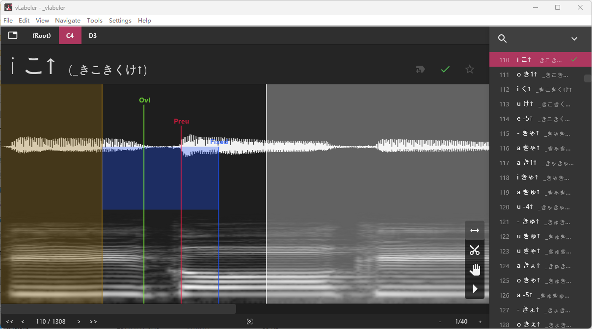
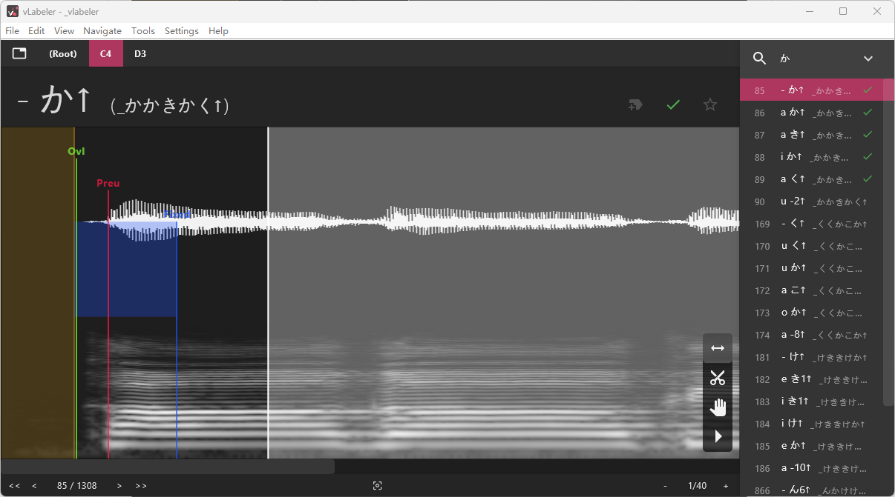
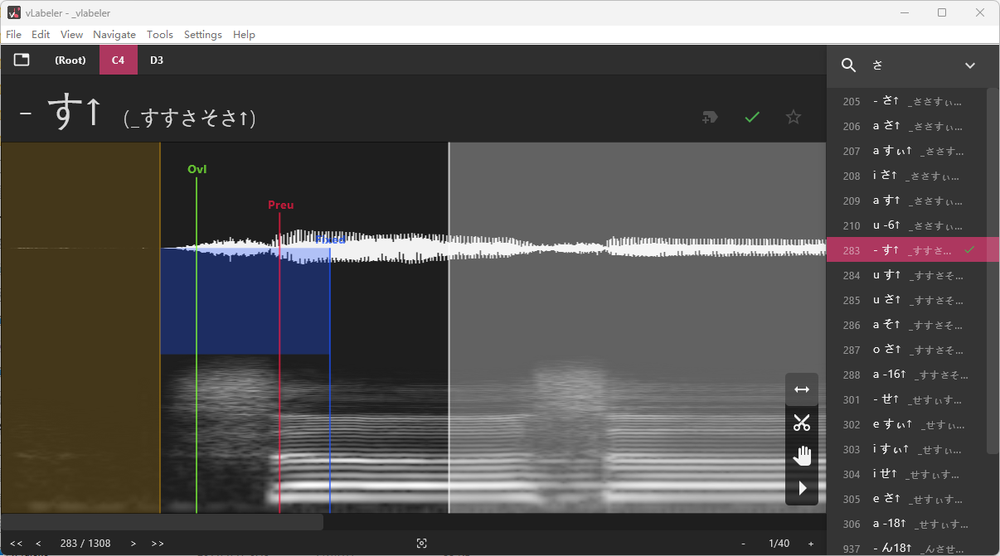

# oto to seg for VOCALOID DBTOOL
Generate the files required for the VOCALOID DB Tool from UTAU's oto.ini

## This is a fork that will house multiple language packs for english UTAU conversion

## Disclaimer: The generated files are not super accurate yet in terms of segmentation. I need to fix that. For now you'll have to look at every articulation segment and make sure it's correct!!


### The only one finished at the moment is Arpasing (although when encountering a numbered alias it throws this, it's not an error that inhibits conversion)


```
[Info] Numbered alias 'g -2' will be ignored.
2024-08-17 03:25:50,562 [oto2lab] ERROR: Failed to parse g -2: 'NoneType' object has no attribute 'type' (oto2seg.py:283)
Traceback (most recent call last):
  File "path\oto2seg.py", line 72, in generate_articulation_segment_info
    if entry_phoneme_info.type == "rcv":
```

### also also there are no I@, U@, e@, etc phonemes in arpasing, so those are not included in the conversion process. You will have to make those manually out of things like ao r or uw r aliases like this below

```
r0.wav=eh r,1939,120,-261.279,110,100
r0.wav=uw r,1159,120,-226.279,110,100
r0.wav=ao r,284,120,-221.279,110,100
```

## Original README

This script will generate trans, seg, cropped wav and as0 files. The only thing you need to do is open dbtool, use File -> auto-alignment, select all entries (with the Shift key), and click 'Add Articulations to DB'

It is recommended to quantify before adding to the database. Method: Select the first item in the Auto Alignment window, click "View/Edit Segmentation", re-select the second item in the Auto Alignment window, and then hold down the "Down" key on the keyboard until the highlight moves to the last item.

# Usage
```
usage: oto2seg.py [-h] [--oto-encoding OTO_ENCODING] [--parser PARSER] [--ignore-vcv] oto_file output_dir

positional arguments:
  oto_file              oto.ini file
  output_dir            output articulation dir

options:
  -h, --help            show this help message and exit
  --oto-encoding OTO_ENCODING
                        oto.ini encoding. default: shift-jis (also ASCII)
  --parser PARSER       oto parser for different languages. default: jpn_common. available parsers:
                            jpn_common
  --ignore-vcv          do not generate VCV segments
```

Notice: The oto that needs to be converted can't contain prefixes, suffixes and substitution items. Please clean them before convert.

## Example
```
python oto2seg.py "E:\Projects\Hayato_CVVC\oto.ini" "E:\Projects\Hayato_V3"
```

# About VCV convertor
This script only accept VCV of moresampler-style. You need to alignment each syllable in oto. You can use moresampler to generate base oto (With 'Rename duplicate items: Yes') and review them.

The convertor only generate trans and seg files. You need to generate and modify articulation segments yourself.

Yamaha plz don't kill me

# OTO Settings snippet
The oto for VCV entries must be in 'moresampler style'.

For VCV entries, you should put overlap to the junction of vowels and consonants.



For - CV entries, you should put offset to the beginning of the consoants.



